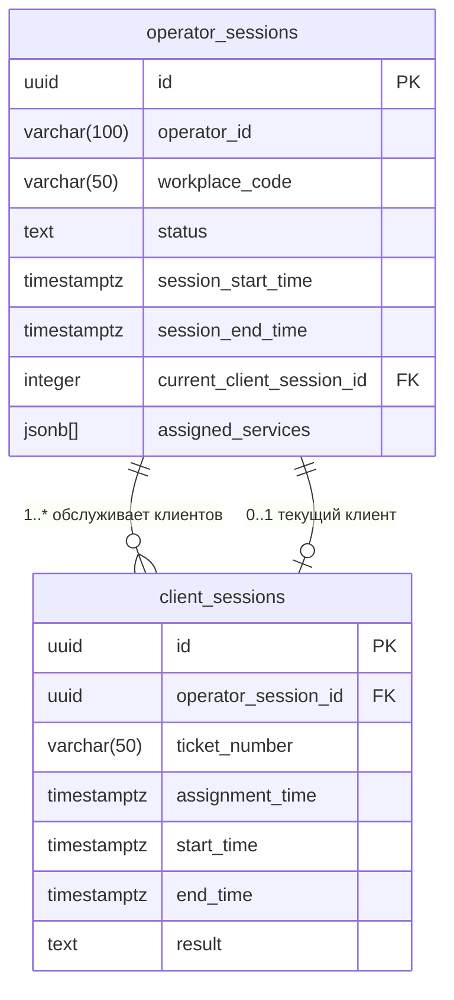

# Схема базы данных - Система "Интерфейс оператора"

## Обзор
Данный документ описывает схему базы данных для системы **"Интерфейс оператора"** - решения для управления очередями операторов, обслуживающих клиентов в сервисных окнах.

## Диаграмма схемы



## Визуализация связей

```
┌─────────────────────────┐           ┌─────────────────────────┐
│    operator_sessions    │ 1       * │    client_sessions      │
│─────────────────────────│◄──────────┤─────────────────────────│
│ id (PK)                 │           │ id (PK)                 │
│ operator_id             │           │ operator_session_id (FK)│
│ workplace_code          │           │ ticket_number           │
│ status                  │           │ assignment_time         │
│ session_start_time      │           │ start_time              │
│ session_end_time        │           │ end_time                │
│ assigned_services[]     │           │ result                  │
│ current_client_session  │─┐    ┌────┴─────────────────────────┘
└─────────────────────────┘ │    │
                            │ 0..1
                            └────┘
                         указывает на
                       текущего клиента
```

## Описание таблиц

### `operator_sessions`
Хранит рабочие сессии операторов с назначенными услугами и текущим состоянием.

| Колонка | Тип | Описание |
|---------|-----|----------|
| `session_id` | `uuid` | Первичный ключ, уникальный идентификатор сессии |
| `operator_id` | `varchar(100)` | Идентификатор оператора (бизнес-ключ) |
| `workplace_code` | `varchar(50)` | Код сервисного окна/рабочего места |
| `status` | `text` | Статус сессии: `Authorized`, `ReadyToWork`, `WaitingAssignment`, `WaitingClient`, `ServingClient`, `Closed` |
| `session_start_time` | `timestamptz` | Время начала работы оператора |
| `session_end_time` | `timestamptz` | Время окончания работы оператора |
| `current_client_session_id` | `integer` | FK к текущей активной сессии клиента (nullable) |
| `assigned_services` | `jsonb[]` | Массив услуг, которые может предоставить оператор |

### `client_sessions`
Отслеживает индивидуальные сессии обслуживания клиентов от назначения до завершения.

| Колонка | Тип | Описание |
|---------|-----|----------|
| `id` | `integer` | Первичный ключ, автогенерируемый |
| `operator_session_id` | `uuid` | FK к сессии оператора |
| `ticket_number` | `varchar(50)` | Номер талона клиента в очереди |
| `assignment_time` | `timestamptz` | Время назначения клиента оператору |
| `service_start_time` | `timestamptz` | Время фактического начала обслуживания (nullable) |
| `service_end_time` | `timestamptz` | Время завершения обслуживания (nullable) |
| `result` | `text` | Результат: `ServiceCompleted` или `ClientNotCame` (nullable) |

## Связи

- **Один-ко-многим**: `operator_sessions` → `client_sessions`
  - Одна сессия оператора может иметь множество сессий клиентов в течение рабочего дня
  
- **Один-к-одному (опционально)**: `operator_sessions` → `client_sessions` (текущий)
  - Указывает на текущую активную сессию клиента (если есть)
  - Использует `ON DELETE SET NULL` для корректной очистки

## Индексы

## Ограничения

### Внешние ключи
```sql
-- Сессии клиентов принадлежат сессиям операторов
ALTER TABLE client_sessions 
    ADD CONSTRAINT fk_client_sessions_operator_sessions_operator_session_id 
    FOREIGN KEY (operator_session_id) REFERENCES operator_sessions (session_id) ON DELETE CASCADE;

-- Ссылка на текущую сессию клиента
ALTER TABLE operator_sessions 
    ADD CONSTRAINT fk_operator_sessions_client_sessions_current_client_session_id 
    FOREIGN KEY (current_client_session_id) REFERENCES client_sessions (id) ON DELETE SET NULL;
```

## Типы данных и особенности

### Специфичные для PostgreSQL возможности
- **JSONB массивы**: `assigned_services` хранит информацию об услугах как структурированные данные
- **Timestamptz**: Все временные метки включают информацию о часовом поясе
- **GIN индекс**: Обеспечивает эффективный поиск внутри JSONB массивов
- **UUID**: Первичные ключи используют UUID для совместимости с распределенными системами

### Примеры данных

#### Сессия оператора
```json
{
  "session_id": "550e8400-e29b-41d4-a716-446655440000",
  "operator_id": "OP123",
  "workplace_code": "ОКНО_01", 
  "status": "ServingClient",
  "assigned_services": [
    {
      "ServiceCode": "PASSPORT",
      "ServiceName": "Паспортные услуги"
    },
    {
      "ServiceCode": "VISA",
      "ServiceName": "Визовые услуги"  
    }
  ]
}
```

#### Сессия клиента
```json
{
  "id": "0198954b-ca35-753d-b1d8-536954b32520",
  "operator_session_id": "550e8400-e29b-41d4-a716-446655440000",
  "ticket_number": "A001",
  "assignment_time": "2025-08-10T10:30:00Z",
  "service_start_time": "2025-08-10T10:32:00Z", 
  "service_end_time": null,
  "result": null
}
```
