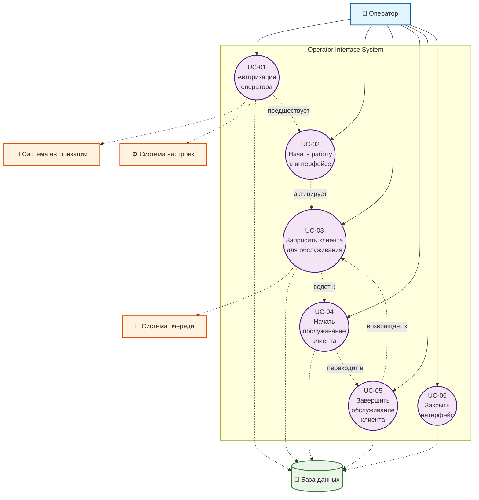
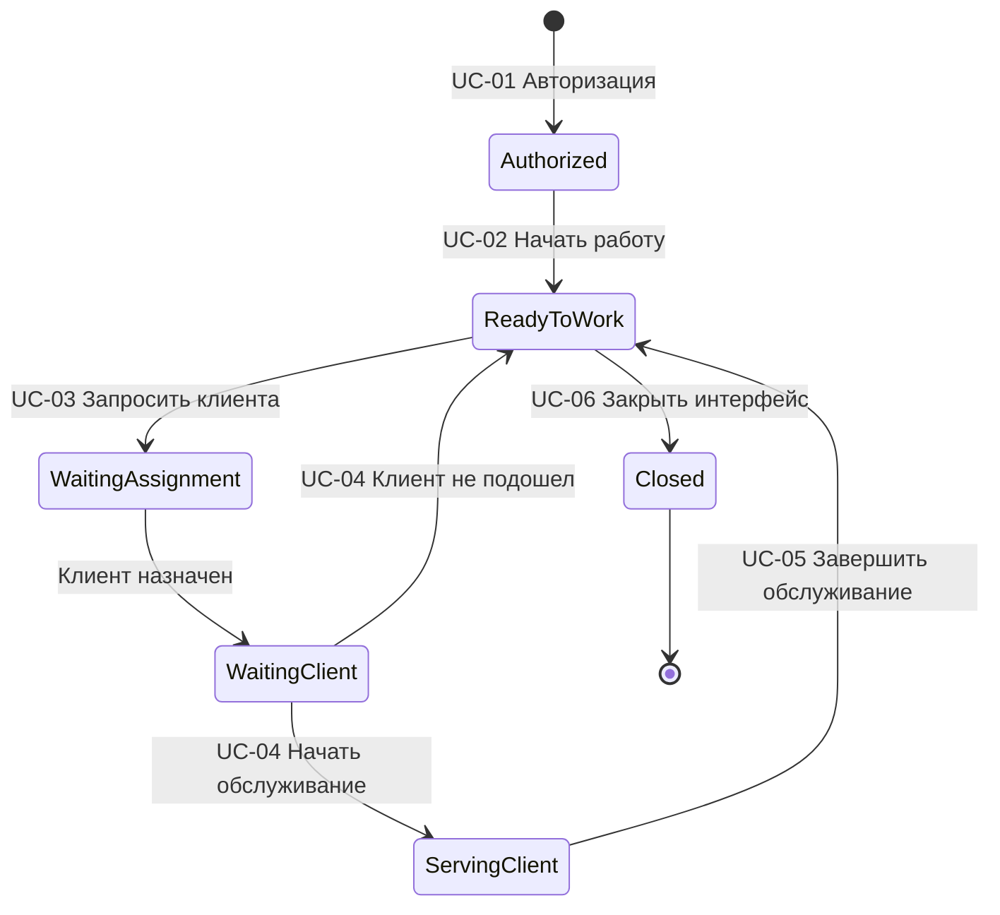

# Use Cases для Operator Interface System

## Обзор системы

**Operator Interface System** - интерфейс оператора для управления процессом обслуживания клиентов в системе электронной очереди. Система предоставляет операторам инструменты для авторизации, управления рабочей сменой и эффективного обслуживания клиентов.

## Use Case диаграмма

## Основные актеры

### Первичные актеры
- **Оператор** - сотрудник, работающий с клиентами через интерфейс системы

### Вторичные актеры (внешние системы)
- **Система авторизации** - проверяет учетные данные и назначения операторов
- **Система очереди** - управляет электронной очередью клиентов
- **Система настроек** - хранит конфигурацию окон и услуг
- **База данных** - сохраняет состояние сессий и операций

## Детальное описание Use Cases

### UC-01: Авторизация оператора

**Актер:** Оператор  
**Описание:** Оператор входит в систему и получает доступ к назначенному рабочему месту  
**Предусловия:** 
- Оператор имеет действующую учетную запись
- Оператор назначен на работу в конкретном окне

**Основной поток:**
1. Оператор вводит логин, пароль и код рабочего места
2. Система проверяет учетные данные и рабочее место через внешнюю систему авторизации
3. Система отображает информацию о назначенном окне и услугах
4. Система создает сессию в локальной базе данных со статусом "Authorized"
5. Система предоставляет доступ к рабочему интерфейсу

**Альтернативные потоки:**
- **1а. Ошибка авторизации**: Неверные данные или оператор работает не с назначенного места
  - Система отображает сообщение об ошибке с деталями из gRPC trailers
  - Система блокирует доступ к интерфейсу
  - Use case завершается неуспешно

**Результат:** Оператор авторизован и готов начать работу

---

### UC-02: Начать работу в интерфейсе

**Актер:** Оператор  
**Описание:** Оператор активирует свое рабочее место и готовится к обслуживанию клиентов  
**Предусловия:** Оператор успешно авторизован в системе (статус сессии "Authorized")

**Основной поток:**
1. Оператор нажимает кнопку "Начать работу" в интерфейсе
2. Система обновляет статус сессии на "ReadyToWork" в базе данных
3. Система фиксирует время начала рабочей смены
4. Система активирует функции управления клиентами в интерфейсе

**Результат:** Интерфейс готов для работы с клиентами

---

### UC-03: Запросить клиента для обслуживания

**Актер:** Оператор  
**Описание:** Оператор запрашивает назначение клиента для обслуживания  
**Предусловия:** Интерфейс активен и готов к работе (статус "ReadyToWork")

**Основной поток:**
1. Оператор нажимает кнопку "Готов принять клиента"
2. Система отправляет запрос в систему очереди на назначение клиента
3. Система переводит сессию в статус "WaitingAssignment"
4. Система очереди назначает клиента и отправляет уведомление
5. Система получает уведомление с номером талона клиента
6. Система переводит сессию в статус "WaitingClient"
7. Система фиксирует время назначения клиента

**Результат:** Клиент назначен, ожидается его подход к окну

---

### UC-04: Начать обслуживание клиента

**Актер:** Оператор  
**Описание:** Оператор начинает обслуживание после того, как назначенный клиент подошел к окну  
**Предусловия:** 
- Клиент назначен (статус сессии "WaitingClient")
- Клиент физически подошел к окну

**Основной поток:**
1. Клиент подходит к окну оператора
2. Оператор нажимает кнопку "Начать обслуживание"
3. Система переводит сессию в статус "ServingClient"
4. Система фиксирует время начала обслуживания
5. Система сохраняет связь между клиентом и началом обслуживания

**Альтернативные потоки:**
- **1а. Клиент не подошел к окну**: 
  - Оператор нажимает кнопку "Клиент не подошел"
  - Система переводит сессию в статус "ReadyToWork"
  - Система фиксирует причину завершения ожидания
  - Use case завершается

**Результат:** Начато активное обслуживание клиента

---

### UC-05: Завершить обслуживание клиента

**Актер:** Оператор  
**Описание:** Оператор завершает обслуживание текущего клиента  
**Предусловия:** Клиент находится в процессе обслуживания (статус "ServingClient")

**Основной поток:**
1. Оператор нажимает кнопку "Завершить обслуживание"
2. Система фиксирует время окончания обслуживания
3. Система переводит сессию в статус "ReadyToWork"

**Результат:** Обслуживание завершено, оператор готов к следующему клиенту

---

### UC-06: Закрыть интерфейс

**Актер:** Оператор  
**Описание:** Оператор завершает работу и закрывает интерфейс  
**Предусловия:** Оператор работает в интерфейсе

**Основной поток:**
1. Оператор нажимает "Закрыть интерфейс"
2. Система проверяет отсутствие активных обслуживаний
3. Система устанавливает статус сессии "Closed"
4. Система фиксирует время окончания смены

**Альтернативные потоки:**
- **2а. Есть активное обслуживание**: 
  - Система предупреждает оператора
  - Система предлагает сначала завершить обслуживание клиента
  - Use case приостанавливается до завершения обслуживания

**Результат:** Рабочая смена завершена, интерфейс закрыт

## Жизненный цикл состояний

## Интеграции с внешними системами

### Система авторизации (gRPC)
- **AuthorizeOperator** - проверка учетных данных и назначений
- **IsSessionActive** - проверка активности сессии

### Система очереди
- **RequestClient** - запрос назначения клиента
- **ClientAssigned** - уведомление о назначении клиента

### База данных
- Сохранение состояния сессий операторов
- История обслуживания клиентов
- Аудит операций

## Примечания по реализации

1. **Асинхронная обработка**: UC-03 использует push-модель для назначения клиентов
2. **Проверка безопасности**: автоматическая валидация сессии при каждом запросе
3. **Обработка ошибок**: детальные сообщения об ошибках через gRPC trailers
4. **Состояние**: четкий жизненный цикл состояний сессии оператора
5. **Интеграция**: слабая связанность с внешними системами через четкие контракты